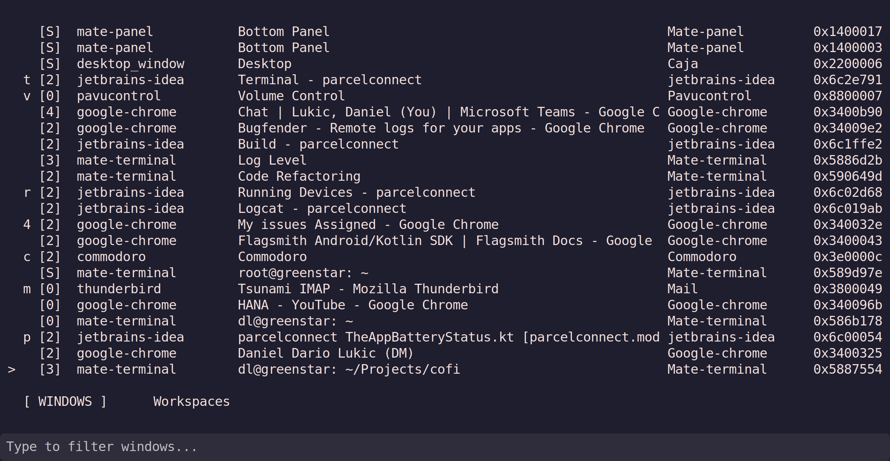

# COFI - C/GTK Window Switcher

COFI is a fast window switcher for X11 Linux desktops, written in C with GTK3. It provides Alt-Tab functionality with real-time fuzzy search and intelligent result ranking.

## Features

- **Instant window switching** with MRU (Most Recently Used) ordering
- **Multi-stage fuzzy matching** with intelligent scoring:
  - Word boundary matches: "comm" → "Commodoro" 
  - Initials matching: "ddl" → "Daniel Dario Lukic"
  - Subsequence matching: "th" → "Thunderbird"
- **Alt-Tab behavior** - pressing Enter switches to the most recent window
- **Harpoon-style assignments** - assign windows to number keys for instant access
- **Event-driven updates** - real-time window list synchronization
- **Single instance** - subsequent launches activate existing window
- **Zero external dependencies** - direct X11 window activation
- **Lightweight** - minimal memory footprint, fast startup

## Building

### Dependencies

- GTK3 development libraries
- X11 development libraries  
- GNU Make
- GCC

On Debian/Ubuntu:

```bash
sudo apt install libgtk-3-dev libx11-dev build-essential
```

### Compilation

```bash
make
```

To build with debug output:

```bash
make debug
```

## Usage

Run cofi:

```bash
./cofi
```

### Command-line Options

- `--log-level LEVEL` (-l) - Set log level: trace, debug, info (default), warn, error, fatal
- `--log-file FILE` (-f) - Write logs to file
- `--no-log` (-n) - Disable logging
- `--align POSITION` (-a) - Window position: center (default), top, top_left, top_right, left, right, bottom, bottom_left, bottom_right
- `--close-on-focus-loss` (-c) - Close window when losing focus
- `--version` (-v) - Show version
- `--help` (-h) - Show help

### Configuration

COFI saves configuration to `~/.config/cofi.json`:

- **options** - Application settings
  - `close_on_focus_loss` - Auto-close on focus loss (boolean)
  - `align` - Default window alignment
- **window_position** - Saved window position
  - `x`, `y` - Window coordinates
  - `saved` - Use saved position (boolean)
- **harpoon_slots** - Window assignments
  - Slots 0-9: Ctrl+0-9 / Alt+0-9
  - Slots a-z: Ctrl+a-z / Alt+a-z (excluding h,j,k,l,u)

### Keyboard Shortcuts

#### Window/Workspace Navigation
- **Up/Down arrows** - Navigate through windows
- **Ctrl+k/Ctrl+j** - Navigate up/down (Vim-style)
- **Tab** - Switch between Windows and Workspaces tabs
- **Ctrl+h/Ctrl+l** - Switch to previous/next tab (Vim-style)
- **Enter** - Activate selected window/workspace
- **Escape** - Cancel and close
- **Type to search** - Filter windows in real-time

#### Harpoon-Style Window Assignment
- **Ctrl+0-9** - Assign current window to number key (0-9)
- **Ctrl+a-z** - Assign current window to letter key (a-z, see exclusions below)
- **Alt+0-9** - Switch directly to window assigned to number
- **Alt+a-z** - Switch directly to window assigned to letter
- **Ctrl+key** on assigned window - Remove assignment (toggle)

**Excluded Keys:**
The following keys are reserved for navigation and cannot be used for harpoon assignments:
- **Ctrl+h** - Switch to previous tab (Workspaces/Windows)
- **Ctrl+j** - Navigate down in selection
- **Ctrl+k** - Navigate up in selection
- **Ctrl+l** - Switch to next tab (Workspaces/Windows)
- **Ctrl+u** - Clear search text (GTK default behavior)

This gives you 31 available harpoon slots: 0-9 and a-g, i, m-t, v-z.

### Window Display

COFI shows windows in a 5-column format:
- **Desktop** - [0-9] for desktop number, [S] for sticky windows
- **Instance** - Application instance name
- **Title** - Window title (truncated to fit)
- **Class** - Application class name
- **ID** - Window ID in hexadecimal

The display is bottom-aligned (fzf-style) with the most recent window at the bottom.

## Example



See how I assigned shortcuts for Thunderbird (m), and my current project (p), the terminal to that project (t), the volume control (v). Cofi makes it easy to jump to these windows directly. For example `<alt-tab><alt-m>` jumps to my mail. Without releasing the `<alt>` key.

To achieve this, I have my Linux Mint window switching reconfigured to map <alt-tab> to `cofi`. That's it!

## Advanced Features

### Intelligent Search

COFI uses multi-stage matching with priority scoring:

1. **Word Boundary** (highest) - Matches at word starts
2. **Initials** (very high) - Matches first letters of words  
3. **Subsequence** (high) - Matches characters in order
4. **Fuzzy** (fallback) - Complex partial matching

### Harpoon Assignments

Inspired by the VIM Harpoon plugin:

- **Persistent** - Assignments saved to `~/.config/cofi.json`
- **Automatic reassignment** - When windows close, intelligently reassign numbers
- **Visual indicators** - Assigned numbers shown in first column
- **Fuzzy reassignment** - Uses partial title matching for smart reassignment

### Single Instance

- Only one COFI window runs at a time
- Subsequent launches activate the existing window
- Clean process management with lock files

### Event-Driven Updates

- Real-time window list updates via X11 PropertyNotify events
- No polling - zero CPU overhead when idle
- Instant response to window creation/destruction

## Installation

```bash
sudo make install
```

This installs cofi to `/usr/local/bin/`.

To uninstall:

```bash
sudo make uninstall
```

## Testing

Run the test suite:

```bash
make test
```

## Architecture

COFI uses a modular architecture with specialized components for:

- Application lifecycle and GTK window management
- X11 window property extraction and activation
- Window enumeration via EWMH protocol
- MRU (Most Recently Used) ordering and Alt-Tab logic
- Multi-stage search with intelligent scoring
- Display formatting and user interface
- Event-driven updates for real-time synchronization
- Single instance management with IPC
- Harpoon-style window assignments
- Workspace switching and management

See [CLAUDE.md](CLAUDE.md) for detailed technical documentation.

## Requirements

- X11-based Linux desktop environment
- Window manager with EWMH support (most modern WMs)
- GTK3 runtime libraries

## License

See [LICENSE](LICENSE) for terms.
