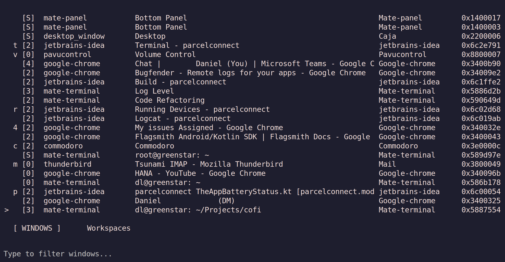

# COFI - C/GTK Window Switcher

COFI is a fast window switcher for X11 Linux desktops, written in C with GTK3. It provides Alt-Tab functionality with real-time fuzzy search and intelligent result ranking.

## Features

- **Instant window switching** with MRU (Most Recently Used) ordering
- **Multi-stage fuzzy matching** with intelligent scoring:
  - Word boundary matches: "comm" → "Commodoro" 
  - Initials matching: "ddl" → "Daniel Dario Lukic"
  - Subsequence matching: "th" → "Thunderbird"
- **Alt-Tab behavior** - pressing Enter switches to the most recent window
- **Harpoon-style assignments** - assign windows to number keys for instant access
- **Custom window naming** - assign custom names to windows for better identification
- **Command mode** - vim-style commands with no-space syntax for window management (`:cw2`, `:tL`, `:j5`)
- **Configurable tiling grid** - choose between 2x2 or 3x2 grid layouts with direct tiling commands
- **Event-driven updates** - real-time window list synchronization
- **Single instance** - subsequent launches activate existing window
- **Zero external dependencies** - direct X11 window activation
- **Lightweight** - minimal memory footprint, fast startup

## Building

### Dependencies

- GTK3 development libraries
- X11 development libraries  
- GNU Make
- GCC

On Debian/Ubuntu:

```bash
sudo apt install libgtk-3-dev libx11-dev build-essential
```

### Compilation

```bash
make
```

To build with debug output:

```bash
make debug
```

## Usage

Run cofi:

```bash
./cofi
```

### Command-line Options


- `--log-level LEVEL` (-l) - Set log level: trace, debug, info (default), warn, error, fatal
- `--log-file FILE` (-f) - Write logs to file
- `--no-log` (-n) - Disable logging
- `--align POSITION` (-a) - Window position: center (default), top, top_left, top_right, left, right, bottom, bottom_left, bottom_right
- `--no-auto-close` (-C) - Don't close window when focus is lost
- `--workspaces` (-w) - Start with the Workspaces tab active
- `--harpoon` (-H) - Start with the Harpoon tab active
- `--names` (-N) - Start with the Names tab active
- `--command` - Start directly in command mode with `:` prompt active
- `--version` (-v) - Show version
- `--help` (-h) - Show help
- `--help-commands` (-H) - Show command mode help

### Configuration

COFI saves configuration to `~/.config/cofi/`:

- **`~/.config/cofi/options.json`** - Application settings
  - `close_on_focus_loss` - Auto-close on focus loss (boolean)
  - `align` - Default window alignment
  - `workspaces_per_row` - Grid layout for workspace view (0 = linear)
  - `tile_columns` - Tiling grid columns: 2 (2x2 grid) or 3 (3x2 grid), default 2
  - `quick_workspace_slots` - Alt+1-9 always switches workspaces when true (boolean, default false)
- **`~/.config/cofi/harpoon.json`** - Window assignments
  - Slots 0-9: Ctrl+0-9 / Alt+0-9
  - Slots a-z: Ctrl+a-z / Alt+a-z (excluding h,j,k,l,u)
- **`~/.config/cofi/names.json`** - Custom window names
  - User-defined names that override window titles
  - Format: `<custom_name> - <original_title>`

### Keyboard Shortcuts

#### Window/Workspace Navigation
- **Up/Down arrows** - Navigate through windows
- **Ctrl+k/Ctrl+j** - Navigate up/down (Vim-style)
- **Tab/Shift+Tab** - Cycle between Windows, Workspaces, Harpoon, and Names tabs
- **Enter** - Activate selected window/workspace
- **Escape** - Cancel and close
- **Type to search** - Filter windows in real-time

#### Custom Window Names (Names Tab)
- **Tab** to Names tab (or launch with `--names`)
- **Ctrl+E** - Edit name for selected window
- **Ctrl+D** - Delete name for selected window
- **Command mode**: `:assign-name`, `:an`, or `:n` - Assign name to selected window

#### Harpoon-Style Window Assignment
- **Ctrl+0-9** - Assign current window to number key (0-9)
- **Ctrl+a-z** - Assign current window to letter key (a-z, see exclusions below)
- **Alt+0-9** - Switch directly to window assigned to number
- **Alt+a-z** - Switch directly to window assigned to letter
- **Ctrl+key** on assigned window - Remove assignment (toggle)

**Excluded Keys:**
The following keys are reserved for navigation and cannot be used for harpoon assignments:
- **Ctrl+j** - Navigate down in selection
- **Ctrl+k** - Navigate up in selection
- **Ctrl+u** - Clear search text (GTK default behavior)

**Override Exclusions with Shift:**
You can override the key exclusions by holding Shift:
- **Ctrl+Shift+j/k/u** - Assign these normally excluded keys as harpoon slots
- This is safe because activation still uses Alt+key (without Shift)
- Example: Ctrl+Shift+j assigns to slot 'j', then Alt+j activates it

This gives you 33 available harpoon slots by default (0-9 and a-i, l-t, v-z), or all 36 slots (0-9 and a-z) when using the Shift override.

#### Quick Workspace Slots Mode

When `quick_workspace_slots` is enabled in options.json:
- **Alt+1-9** - Always switches directly to workspaces 1-9 (regardless of current tab)
- **Ctrl+1-9** - Still assigns/unassigns harpoon slots as normal
- **Harpoon window access** - Use the Harpoon tab or other methods to access harpooned windows

This mode is useful if you prefer quick workspace switching over quick window switching, similar to many window managers and browsers.

### Command Mode

Press `:` to enter command mode for advanced window management operations. Commands can be typed with or without spaces between the command and arguments. Command mode preserves your current window selection unless you're entering from the default alt-tab position. In that latter case, selection will auto-jump to the previously active window. This will allow quick command application to the currently active window without having to select it first.


#### Available Commands

**Window Management:**
- `:cw [N]` or `:change-workspace [N]` - Move selected window to workspace N
  
  
- `:pw` or `:pull-window` or `:p` - Pull selected window to current workspace
- `:tm` or `:toggle-monitor` - Move window to next monitor
- `:tw [OPT]` or `:tile-window [OPT]` or `:t [OPT]` - Tile window
  - Options: L/R/T/B (halves), 1-4 (2x2 grid) or 1-6 (3x2 grid), F (fullscreen), C (center)
  - Direct tiling: `:t[lrtbc][1-4]` for quick sizing
    - Sizes: 1=25%, 2=50%, 3=66%, 4=75% (or 100% for center)
    - Examples: `:tr4` (right 75%), `:tl2` (left 50%), `:tc1` (center 33%), `:tc4` (fullscreen)
  
  
- `:cl` or `:close-window` or `:c` - Close selected window
- `:mw` or `:maximize-window` or `:m` - Toggle maximize
- `:hm` or `:horizontal-maximize-window` - Toggle horizontal maximize
- `:vm` or `:vertical-maximize-window` - Toggle vertical maximize

**Window Properties:**
- `:sb` or `:skip-taskbar` - Toggle skip taskbar
- `:at` or `:always-on-top` or `:aot` - Toggle always on top
- `:ew` or `:every-workspace` - Toggle sticky (show on all workspaces)

**Navigation:**
- `:jw [N]` or `:jump-workspace [N]` or `:j [N]` - Jump to workspace N
  
  
- `:help` or `:h` or `:?` - Show command help

**Window Naming:**
- `:assign-name` or `:an` or `:n` - Assign custom name to selected window

#### No-Space Syntax

Commands with arguments can be typed without spaces for faster entry:
- `:cw2` - Move window to workspace 2
- `:j5` - Jump to workspace 5  
- `:tL` - Tile window left half
- `:t5` - Tile to grid position 5
- `:tr4` - Tile window right 75%
- `:tl1` - Tile window left 25%
- `:tc3` - Center window at 75% size

This vim-style syntax works alongside traditional space-separated commands.

### Window Display

COFI shows windows in a 5-column format:
- **Desktop** - [0-9] for desktop number, [S] for sticky windows
- **Instance** - Application instance name
- **Title** - Window title (truncated to fit)
- **Class** - Application class name
- **ID** - Window ID in hexadecimal

The display is bottom-aligned (fzf-style) with the most recent window at the bottom.

## Example



See how I assigned shortcuts for Thunderbird (m), and my current project (p), the terminal to that project (t), the volume control (v). Cofi makes it easy to jump to these windows directly. For example `<alt-tab><alt-m>` jumps to my mail. Without releasing the `<alt>` key.

To achieve this, I have my Linux Mint window switching reconfigured to map <alt-tab> to `cofi`. That's it!


## Advanced Features

### Intelligent Search

COFI uses multi-stage matching with priority scoring:

1. **Word Boundary** (highest) - Matches at word starts
2. **Initials** (very high) - Matches first letters of words  
3. **Subsequence** (high) - Matches characters in order
4. **Fuzzy** (fallback) - Complex partial matching

### Harpoon Assignments

Inspired by the VIM Harpoon plugin:

- **Persistent** - Assignments saved to `~/.config/cofi/harpoon.json`
- **Automatic reassignment** - When windows close, intelligently reassign numbers
- **Visual indicators** - Assigned numbers shown in first column
- **Fuzzy reassignment** - Uses partial title matching for smart reassignment

### Custom Window Naming

Give windows meaningful custom names for better identification:

- **Override titles** - Custom names appear as `<custom_name> - <original_title>`
- **Persistent storage** - Names saved to `~/.config/cofi/names.json`
- **Smart reassignment** - When windows close, intelligently reassign names using fuzzy matching
- **Integrated search** - Custom names are included in filtering and search
- **Tab interface** - Dedicated Names tab for managing all custom names
- **Command support** - Use `:assign-name` command or Names tab shortcuts

### Single Instance

- Only one COFI window runs at a time
- Subsequent launches activate the existing window
- Clean process management with lock files

### Event-Driven Updates

- Real-time window list updates via X11 PropertyNotify events
- No polling - zero CPU overhead when idle
- Instant response to window creation/destruction

## Installation

```bash
sudo make install
```

This installs cofi to `/usr/local/bin/`.

To uninstall:

```bash
sudo make uninstall
```

## Testing

Run the test suite:

```bash
make test
```

## Architecture

COFI uses a modular architecture with specialized components for:

- Application lifecycle and GTK window management
- X11 window property extraction and activation
- Window enumeration via EWMH protocol
- MRU (Most Recently Used) ordering and Alt-Tab logic
- Multi-stage search with intelligent scoring
- Display formatting and user interface
- Event-driven updates for real-time synchronization
- Single instance management with IPC
- Harpoon-style window assignments
- Workspace switching and management

See [CLAUDE.md](CLAUDE.md) for detailed technical documentation.

## Requirements

- X11-based Linux desktop environment
- Window manager with EWMH support (most modern WMs)
- GTK3 runtime libraries

## License

See [LICENSE](LICENSE) for terms.
